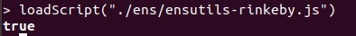

# Ejercicio 1 - ENS (1 punto)

Adquiera un dominio bajo el TLD ‘.test’ en la testnet Rinkeby.  

Describa el procedimiento seguido paso a paso.  

Demuestre que es usted poseedor del dominio adquirido y obtenga la dirección del Resolver utilizado. (Adjunte un pantallazo con todas las instrucciones utilizadas y sus outputs).  

_*Tenga en cuenta que la duración de la propiedad de los dominios en testnet es de 28 días._

---
1ª) Descargamos el fichero ensutils-testnet.js desde la siguiente url:
https://github.com/ensdomains/ens/blob/master/ensutils-testnet.js

2º) Cambiamos las direcciones en ensutils-testnet.js para que pueda funcionar sobre Rinkedy:

- Línea 220: contract address: 0xe7410170f87102df0055eb195163a03b7f2bff4a
- Línea 1314: publicResolver address: 0x5d20cf83cb385e06d2f2a892f9322cd4933eacdc

3º) Una vez modificado, cargamos el script en el cliente Geth:

$ geth --rinkeby attach  

> loadScript("./ens/ensutils-rinkeby.js")



**4º) Ejecutamos el comando que nos permitirá ver si el dominio .test que queremos reserva está disponible (si el valor devuelto es cero):

> testRegistrar.expiryTimes(web3.sha3("midomain"))

Sin embargo, nos devuelve el siguiente error:
````
Error: invalid address
    at web3.js:3930:15
    at web3.js:3734:22
    at web3.js:5025:28
    at map (<native code>)
    at web3.js:5024:12
    at web3.js:5050:18
    at web3.js:5075:23
    at web3.js:4102:22
    at apply (<native code>)
    at web3.js:4227:12
````	 

1ª) Descargamos el fichero ensutils-testnet.js desde la siguiente url:
https://github.com/ensdomains/ens/blob/master/ensutils-testnet.js
````

2º) Cambiamos las direcciones en ensutils-testnet.js para que pueda funcionar sobre Rinkedy:

- Línea 220: contract address: 0xe7410170f87102df0055eb195163a03b7f2bff4a
- Línea 1314: publicResolver address: 0x5d20cf83cb385e06d2f2a892f9322cd4933eacdc

3º) Una vez modificado, cargamos el script en el cliente Geth:

$ geth --rinkeby attach 
 
> loadScript("./ens/ensutils-rinkeby.js")


4º) Ejecutamos el comando que nos permitirá ver si el dominio .test que queremos reserva está disponible (si el valor devuelto es cero):

> testRegistrar.expiryTimes(web3.sha3("midomain"))

Sin embargo, nos devuelve el siguiente error:
````
Error: invalid address
    at web3.js:3930:15
    at web3.js:3734:22
    at web3.js:5025:28
    at map (<native code>)
    at web3.js:5024:12
    at web3.js:5050:18
    at web3.js:5075:23
    at web3.js:4102:22
    at apply (<native code>)
    at web3.js:4227:12
````	
	
Si vemos el mensaje que se generar al arrancar la consola vemos que el bloque (at block) es cero:

>instance: Geth/v1.8.27-stable-4bcc0a37/linux-amd64/go1.10.4  
>coinbase: 0xeb427055ac4a192cd18d49c208903aa5c00ccd19  
>at block: **0** (Wed, 12 Apr 2017 16:59:06 CEST)  
> datadir: /home/lealp22/.ethereum/rinkeby  
> modules: admin:1.0 clique:1.0 debug:1.0 eth:1.0 miner:1.0 net:1.0 personal:1.0 rpc:1.0 txpool:1.0 web3:1.0	
 
Por tanto, es necesario tener el nodo de Rinkeby completamente sincronizado para poder ejecutar este comando. 


********************** FALTA. EN CONSTRUCCION *********************************


