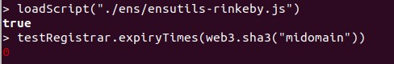
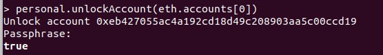
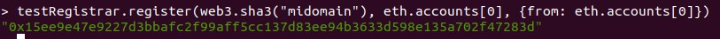
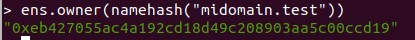
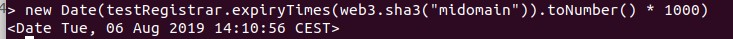
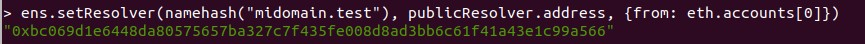
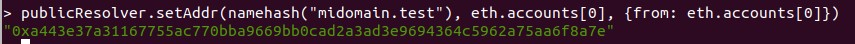
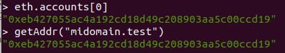

# Ejercicio 1 - ENS (1 punto)

Adquiera un dominio bajo el TLD ‘.test’ en la testnet Rinkeby.  

Describa el procedimiento seguido paso a paso.  

Demuestre que es usted poseedor del dominio adquirido y obtenga la dirección del Resolver utilizado. (Adjunte un pantallazo con todas las instrucciones utilizadas y sus outputs).  

_*Tenga en cuenta que la duración de la propiedad de los dominios en testnet es de 28 días._

---

**1º)** Arrancamos Geth con los siguientes parámetros:
> _> geth --rinkeby --syncmode "fast" --rpc --rpcapi db,eth,net,web3,personal --cache=1024 --rpcport 8545 --rpcaddr 127.0.0.1 --rpccorsdomain "*"_

**2º)** Descargamos el fichero ensutils-testnet.js desde la siguiente url:

> _https://github.com/ensdomains/ens/blob/master/ensutils-testnet.js_

> Y cambiamos las direcciones incluidas en el código para que pueda funcionar sobre Rinkedy:

> - **Línea 220**: contract address: _0xe7410170f87102df0055eb195163a03b7f2bff4a_
> - **Línea 1314**: publicResolver address: _0x5d20cf83cb385e06d2f2a892f9322cd4933eacdc_

**3º)** Una vez modificado, cargamos el script en el cliente Geth:

> _$ geth --rinkeby attach_  
> _> loadScript("./ens/ensutils-rinkeby.js")_  


**4º)** Ejecutamos el comando que nos permitirá ver si el dominio .test que queremos reservar está disponible (si el valor devuelto es cero):

> _> testRegistrar.expiryTimes(web3.sha3("midomain"))_

>Sin embargo, nos devuelve el siguiente error:
````
     Error: invalid address
         at web3.js:3930:15
         at web3.js:3734:22
         at web3.js:5025:28
         at map (<native code>)
         at web3.js:5024:12
         at web3.js:5050:18
         at web3.js:5075:23
         at web3.js:4102:22
         at apply (<native code>)
         at web3.js:4227:12
````	 

* Si nos fijamos en el mensaje que aparece al arrancar la consola, veremos que el bloque (_at block_) es cero:
````
     instance: Geth/v1.8.27-stable-4bcc0a37/linux-amd64/go1.10.4  
     coinbase: 0xeb427055ac4a192cd18d49c208903aa5c00ccd19  
     at block: 0 (Wed, 12 Apr 2017 16:59:06 CEST)  
      datadir: /home/lealp22/.ethereum/rinkeby  
```` 
>Por tanto, es necesario tener el nodo de Rinkeby completamente sincronizado para poder ejecutar este comando. Nos deberá aparecer algo similar a:
````
     instance: Geth/v1.8.27-stable-4bcc0a37/linux-amd64/go1.10.4  
     coinbase: 0xeb427055ac4a192cd18d49c208903aa5c00ccd19  
     at block: 4701880 (Tue, 09 Jul 2019 09:40:26 CEST)  
      datadir: /home/lealp22/.ethereum/rinkeby  
````
**5º)** Una vez sincronizado, volvemos a ejecutar los pasos 3 y 4. En esta ocasión veremos como sí es posible consultar la disponibilidad del dominio correctamente:



**6º)** Dado que nos devuelve cero y, por tanto, el dominio está disponible, procedemos a registrarlo: 

* Antes debemos desbloquear la cuenta que vamos a utilizar _(0xeb427055ac4a192cd18d49c208903aa5c00ccd19)_:

> _> personal.unlockAccount(eth.accounts[0])_



* Si la cuenta no tiene saldo, como es nuestro caso, se puede utilizar el _Faucet_ en [https://faucet.rinkeby.io/](https://faucet.rinkeby.io/). En esta ocasión recibimos 7,5 ether a través de la transacción [0xde3042dc12bfa1a35f1b9e667a05592e6d58f29e54538f7974b644e142abab1d](https://rinkeby.etherscan.io/tx/0xde3042dc12bfa1a35f1b9e667a05592e6d58f29e54538f7974b644e142abab1d).  

- Ya con la cuenta preparada, solicitamos el registro del dominio:

> _> testRegistrar.register(web3.sha3("midomain"), eth.accounts[0], {from: eth.accounts[0]})_



> El hash de la transacción es [0x15ee9e47e9227d3bbafc2f99aff5cc137d83ee94b3633d598e135a702f47283d](https://rinkeby.etherscan.io/tx/0x15ee9e47e9227d3bbafc2f99aff5cc137d83ee94b3633d598e135a702f47283d)

* Una vez minada la transacción ya podemos comprobar que somos el _propietario_ del dominio:

> _> ens.owner(namehash("midomain.test"))_



> Al menos hasta el 6 de agosto 2019:



**7º)** Ahora que tenemos registrado el dominio debemos indicar cómo se debe resolver:

* Primero indicamos cuál será el _Resolver_ (publicResolver) para este dominio:

> _> ens.setResolver(namehash("midomain.test"), publicResolver.address, {from: eth.accounts[0]})_



> El hash de la transacción es [0xbc069d1e6448da80575657ba327c7f435fe008d8ad3bb6c61f41a43e1c99a566](https://rinkeby.etherscan.io/tx/0xbc069d1e6448da80575657ba327c7f435fe008d8ad3bb6c61f41a43e1c99a566).

* _publicResolver.address_ (0x5d20cf83cb385e06d2f2a892f9322cd4933eacdc) es la dirección del _Resolver_ que fue parametrizada en el primer paso, en la línea 1314 de _ensutils-testnet.js_.

- Luego, le indicamos al _Resolver_ cómo resolver o traducir el dominio que hemos registrado:

> _> publicResolver.setAddr(namehash("midomain.test"), eth.accounts[0], {from: eth.accounts[0]})_



> El hash de la transacción es [0xa443e37a31167755ac770bba9669bb0cad2a3ad3e9694364c5962a75aa6f8a7e](https://rinkeby.etherscan.io/tx/0xa443e37a31167755ac770bba9669bb0cad2a3ad3e9694364c5962a75aa6f8a7e).

**8º)** Para confirmar que el dominio se resuelve correctamente:

> _> getAddr("midomain.test")_




