# Ejercicio 2 - IPFS (3 puntos)

A partir de un truffle project como puede ser la pet-shop utilizada en bloques anteriores.

_*También puede utilizar otro truffle project._

Haga una pequeña modificación en su frontend para mostrar su nombre al ejecutar la aplicación. (Puede editar cualquier parámetro adicional, siempre y cuando el nombre sea visible).

Suba el truffle project a GitHub manteniendo su estructura. (No incluya la carpeta node_modules).

Arranque un daemon de IPFS y aloje la DApp (Proyecto truffle elegido).

Una vez alojada la DApp, debe ser capaz de utilizar la aplicación al igual que en localhost, es decir, firmando transacciones mediante MetaMask.

Describa todo el procedimiento adjuntando las instrucciones utilizadas y sus outputs, además adjunte el hash de IPFS. Se recomienda realizar la carga (o recarga si ya ha realizado la carga en IPFS) en una fecha cercana a la entrega. Esto es debido a que si realiza la carga en una fecha temprana, puede que el contenido tarde o no llegue incluso a cargar. También debe indicar si los contratos están desplegados en Ganache o
Rinkeby.

_*Se recomienda alojar el contenido a subir en IPFS en una única carpeta, ésta también debe alojarse en GitHub._

---
**1º)** Siguiendo la indicaciones del Webpack Truffle Box en GitHub [(https://github.com/truffle-box/webpack-box)](https://github.com/truffle-box/webpack-box) instalamos la aplicación de MetaCoin:

- Ejecutamos el comando para el unbox:

> _$ truffle unbox webpack_

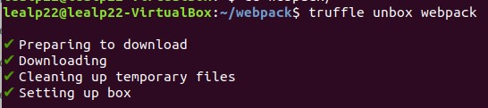

- Abrimos una consola de desarrollo de Truffle (_truffle develop_) para poder ejecutar los comandos _compile_ y _migrate_:

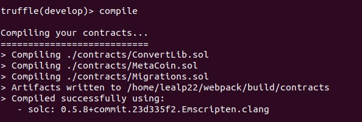

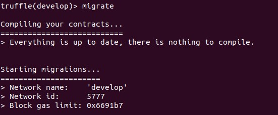

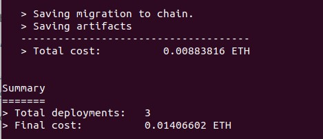

**2º)** Hacemos una pequeña modificación en el frontend para incluir el nombre (en _src/index.html_). 

**3º)** Abrimos otro terminal y desde el directorio _app_ arrancamos la aplicación para comprobar que funciona en local y la modificación es correcta:

> _$ npm run dev_

- Una vez configurado MetaMask para que funcione con el nodo local (http://127.0.0.1:8545/) e importamos una de las cuentas disponibles, vemos que funciona correctamente:

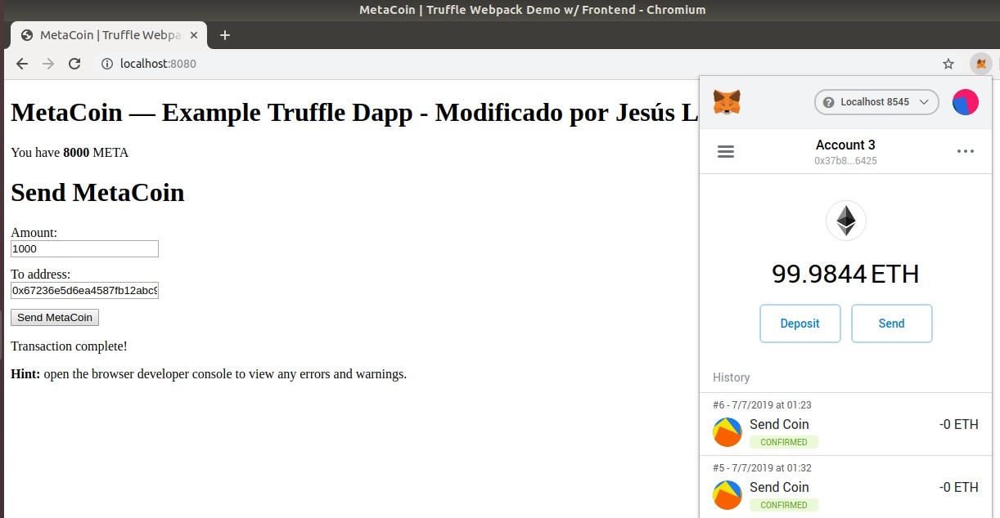

**4º)** Preparamos la aplicación para su posterior despliegue en IPFS:

> _$ npm run build_

> Esto deja en el directorio _app/dist_ los componentes listos para el despliegue.

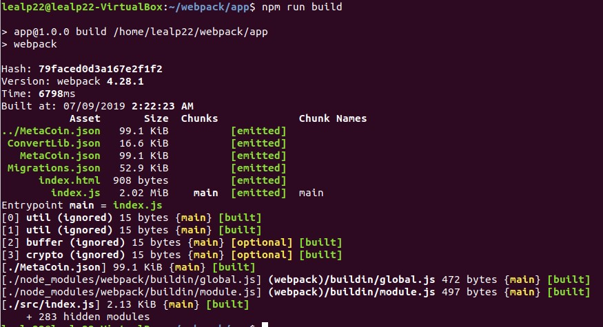

* Indicar que previamente se modificó el fichero _webpack.config.js_ para que se copiasen los ficheros json del directorio _../build/contracts/_ al directorio _/dist_ y tener todos los componentes necesarios para ejecutar la web en un único directorio).  
* En línea con esto, también se modificó el componente _app/src/index.js_ para incluir el siguiente cambio:  
>> //import metaCoinArtifact from "../../build/contracts/MetaCoin.json";  
>> import metaCoinArtifact from "../MetaCoin.json";  

**5º)** Subimos nuestro _truffle project_ a GitHub:

> Repositorio: [https://github.com/lealp22/MetaCoin](https://github.com/lealp22/MetaCoin)

**6º)** Preparamos el entorno de IPFS:

- Descargamos el binario desde _https://dist.ipfs.io/#go-ipfs_ y seguimos las instrucciones de instalacion indicadas en _https://docs.ipfs.io/guides/guides/install/_  

> _$ cd ~/Descargas_  
> _$ tar xvfz go-ipfs_v0.4.21_linux-amd64.tar.gz_  
> _$ cd go-ipfs/_  
> _$ sudo ./install.sh_  

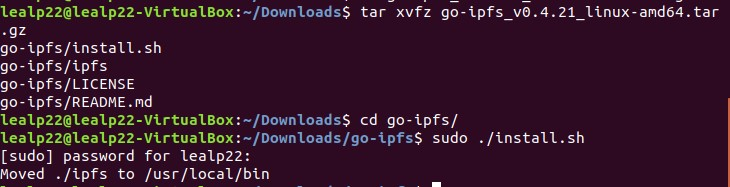

- Seguimos las instrucciones en _https://docs.ipfs.io/introduction/usage/_

> _$ ipfs init_

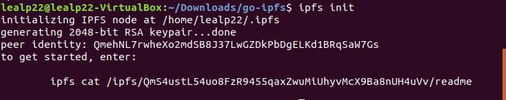

> Con lo que obtenemos:  
>> **_- peer identity: QmehNL7rwheXo2mdSB8J37LwGZDkPbDgELKd1BRqSaW7Gs_**  
>> _- hash: QmS4ustL54uo8FzR9455qaxZwuMiUhyvMcX9Ba8nUH4uVv_  

- Arrancamos IPFS en nuestra máquina:

> _$ ipfs daemon_
 
- En otra terminal, subimos a IPFS el directorio que contiene la aplicación:

> _$ ipfs add -r dist/_

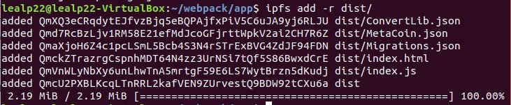

* Nos quedamos con el último hash, el del directorio principal:
> _**QmcU2PXBLKcqLTnRRL2kafVEN9ZUrvestQ9BDW92tCXu6a**_
 
- Utilizamos este hash para publicar el directorio en IPFS:  
> _$ ipfs name publish QmcU2PXBLKcqLTnRRL2kafVEN9ZUrvestQ9BDW92tCXu6a_

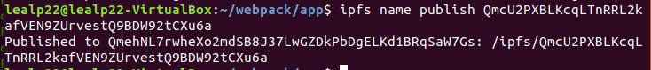

* Comprobamos el contenido publicado:

> _$ ipfs ls /ipfs/QmcU2PXBLKcqLTnRRL2kafVEN9ZUrvestQ9BDW92tCXu6a_

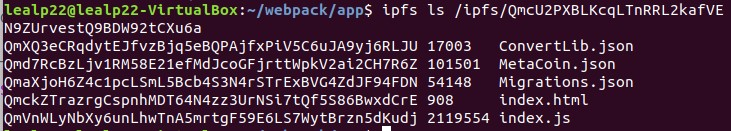

**7º)** Accedemos a la aplicación publicada en IPFS para comprobar que funciona correctamente:

> _https://ipfs.io/ipfs/QmcU2PXBLKcqLTnRRL2kafVEN9ZUrvestQ9BDW92tCXu6a/index.html_

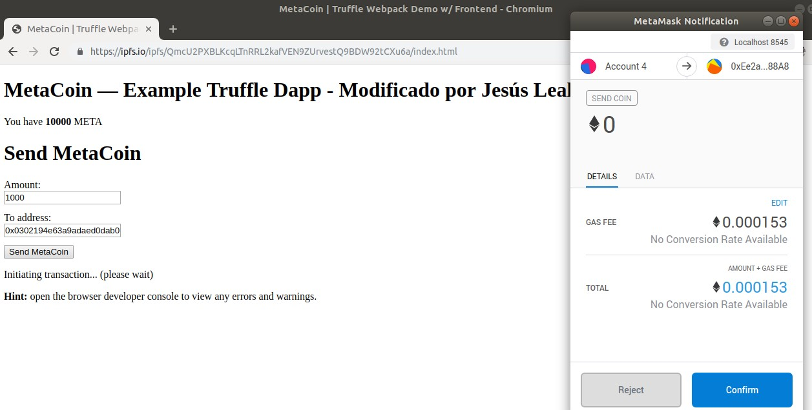

_*Los contratos no han sido desplegados en Rinkeby. En vez de utilizar Ganache se ha utilizado _truffle develop_ que también crea una blockchain en local. 

