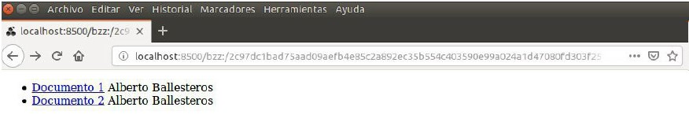
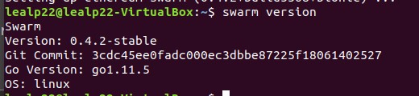
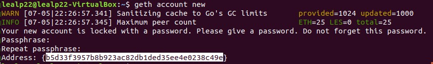
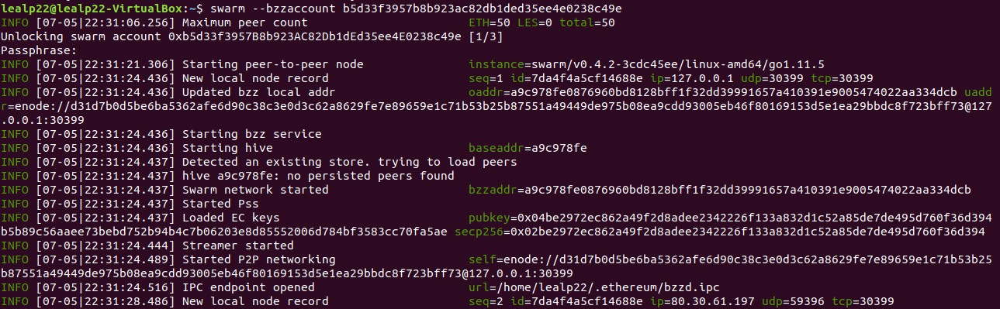
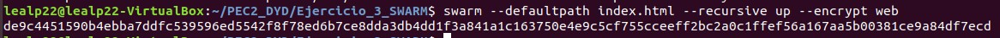
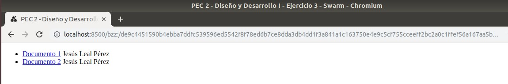
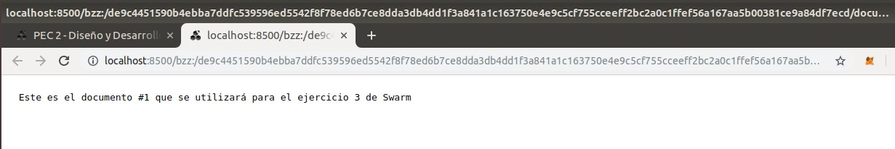
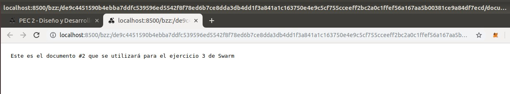

# Ejercicio 3 - SWARM (2 puntos)

Cree una página web básica (archivo HTML) en la cual se muestren los vínculos a dos archivos distintos alojados en Swarm además de su nombre.

En la subida de los archivos debe utilizar el cifrado disponible en Swarm.

No se considerará válido si se suben los contenidos por separado y se vinculan en el archivo HTML posteriormente. Al navegar entre los archivos, el hash de Swarm mostrado en la barra de direcciones no debe cambiar.

La respuesta a este ejercicio debe ser algo de este estilo:

No es necesario vincular el hash de Swarm a ENS.

---
**1º)** Preparamos Swarm de acuerdo a lo indicado en la web https://swarm-guide.readthedocs.io/en/latest/installation.html.  

Dado que el repositorio PPA ya quedó preparado con la instalación de Ethereum, solo ejecutamos:

> _$ sudo apt-get update_  
> _$ sudo apt-get install ethereum-swarm_

Comprobamos se ha instalado correctamente:

**2º)** Continuamos con las indicaciones según la web https://swarm-guide.readthedocs.io/en/latest/gettingstarted.html

- Creamos una cuenta con Geth:

> _$ geth account new_

> _b5d33f3957b8b923ac82db1ded35ee4e0238c49e_

- Conectamos con Swarm utilizando la nueva cuenta

> _$ swarm --bzzaccount b5d33f3957b8b923ac82db1ded35ee4e0238c49e_

- Verificamos que nuestro nodo local está funcionando:

> _http://localhost:8500_

**3º)** Abrimos otro terminal para subir los componentes de la web:

>Los componentes a subir están en el directorio [web](./web/) y son:
- _index.html_
- _documento1.txt_
- _documento2.txt_

> El comando para ello es:  
> _$ swarm --defaultpath index.html --recursive up --encrypt web_

Con _defaulpath_ se muestra por defecto el fichero indicado (con la url resultante), con _recursive_ se especifica se deben subir los ficheros y carpetas incluidos en el directorio indicado y con _encrypt_ que el contenido este encriptado y nadie más lo pueda utilizar.

Obtenemos el hash:
_de9c4451590b4ebba7ddfc539596ed5542f8f78ed6b7ce8dda3db4dd1f3a841a1c163750e4e9c5cf755cceeff2bc2a0c1ffef56a167aa5b00381ce9a84df7ecd_

**4º)** Con el hash componemos la url en Swarm y comprobamos que los componentes se han cargado correctamente:

[http://localhost:8500/bzz:/de9c4451590b4ebba7ddfc539596ed5542f8f78ed6b7ce8dda3db4dd1f3a841a1c163750e4e9c5cf755cceeff2bc2a0c1ffef56a167aa5b00381ce9a84df7ecd](http://localhost:8500/bzz:/de9c4451590b4ebba7ddfc539596ed5542f8f78ed6b7ce8dda3db4dd1f3a841a1c163750e4e9c5cf755cceeff2bc2a0c1ffef56a167aa5b00381ce9a84df7ecd)

> Podemos comprobar que al pinchar sobre ambos documentos el hash en la barra del explorador no cambia:
- documento1.txt  

- documento2.txt  

