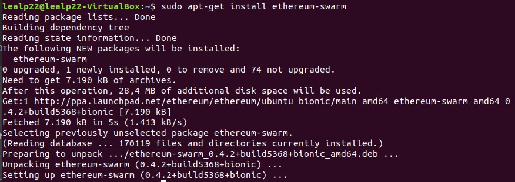

# Ejercicio 3 - SWARM (2 puntos)

Cree una página web básica (archivo HTML) en la cual se muestren los vínculos a dos archivos distintos alojados en Swarm además de su nombre.

En la subida de los archivos debe utilizar el cifrado disponible en Swarm.

No se considerará válido si se suben los contenidos por separado y se vinculan en el archivo HTML posteriormente. Al navegar entre los archivos, el hash de Swarm mostrado en la barra de direcciones no debe cambiar.

La respuesta a este ejercicio debe ser algo de este estilo:

No es necesario vincular el hash de Swarm a ENS.
---
