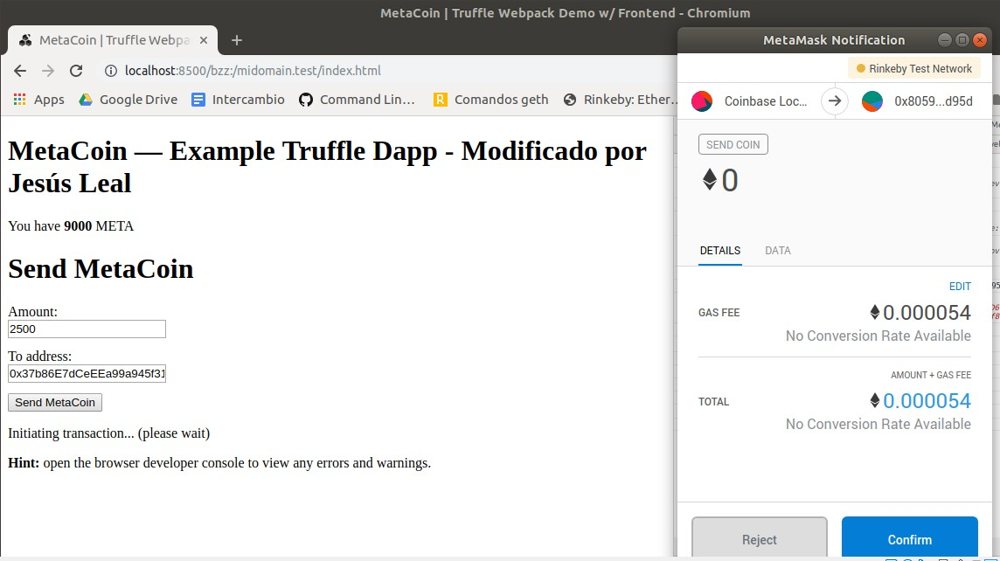

# Ejercicio 4 - SWARM (4 puntos)

Puede reutilizar parte de lo que ha realizado en el ejercicio 2 (hasta subir el proyecto a GitHub).

Arranque un nodo de Swarm y aloje la DApp (Proyecto truffle elegido).

Además, vincule el ENS adquirido en el ejercicio 1 con la DApp, de tal forma que una url como la de a continuación muestre la aplicación. Por ejemplo:

http://localhost:8500/bzz:/swarmtest.test/index.html

Una vez alojada la DApp, debe ser capaz de utilizar la aplicación al igual que en localhost, es decir, firmando transacciones mediante MetaMask.

Adjunte el hash de Swarm asociado con la aplicación.

Describa todo el procedimiento adjuntando las instrucciones utilizadas y sus outputs. Adjunte todos los pantallazos que considere relevantes (como puede ser el navegador mostrando la aplicación o transacciones de MetaMask, entre otros) e indique las direcciones de los contratos en la red correspondiente (Rinkeby, Ropsten...).

---

**1º)** Dado que en este ejercicio sí vamos a desplegar los contratos en Rinkeby, modificamos _truffle-config.js_ para añadir la red _rinkeby_:
````
    module.exports = {
      networks: {
      ...
        rinkeby: {
          host: "localhost", // Connect to geth on the specified
          port: 8545,
          from: "0xeb427055ac4a192cd18d49c208903aa5c00ccd19", // default address to use for any transaction Truffle makes during migrations
          network_id: 4,
          gas: 4612388 // Gas limit used for deploys
        }
        ...
      }
    };
````

**2º)** Arrancamos Geth con los siguientes parámetros:
> _> geth --rinkeby --syncmode "fast" --rpc --rpcapi db,eth,net,web3,personal --cache=1024 --rpcport 8545 --rpcaddr 127.0.0.1 --rpccorsdomain "*"_

**3º)** Con esto ya podemos migrar los contratos a la red Rinkeby

> _$ truffle migrate --network rinkeby_

+ Antes de ejecutar esto, la cuenta indicada en _truffle-config.js_ deberá ser desbloqueada. En este caso se ha hecho en la consola de Geth con el comando _personal.unlockAccount("0xeb427055ac4a192cd18d49c208903aa5c00ccd19")_.

````
Migrations dry-run (simulation)
===============================
> Network name:    'rinkeby-fork'
> Network id:      4
> Block gas limit: 0x6acfc0


1_initial_migration.js
======================

   Deploying 'Migrations'
   ----------------------
   > block number:        4711537
   > block timestamp:     1562802872
   > account:             0xEb427055Ac4a192cD18d49c208903AA5c00cCd19
   > balance:             7.49934057
   > gas used:            246393
   > gas price:           2 gwei
   > value sent:          0 ETH
   > total cost:          0.000492786 ETH

   -------------------------------------
   > Total cost:         0.000492786 ETH


2_deploy_contracts.js
=====================

   Deploying 'ConvertLib'
   ----------------------
   > block number:        4711539
   > block timestamp:     1562802873
   > account:             0xEb427055Ac4a192cD18d49c208903AA5c00cCd19
   > balance:             7.499079278
   > gas used:            103623
   > gas price:           2 gwei
   > value sent:          0 ETH
   > total cost:          0.000207246 ETH


   Linking
   -------
   * Contract: MetaCoin <--> Library: ConvertLib 

   Deploying 'MetaCoin'
   --------------------
   > block number:        4711540
   > block timestamp:     1562802874
   > account:             0xEb427055Ac4a192cD18d49c208903AA5c00cCd19
   > balance:             7.49843258
   > gas used:            323349
   > gas price:           2 gwei
   > value sent:          0 ETH
   > total cost:          0.000646698 ETH

   -------------------------------------
   > Total cost:         0.000853944 ETH


Summary
=======
> Total deployments:   3
> Final cost:          0.00134673 ETH


Starting migrations...
======================
> Network name:    'rinkeby'
> Network id:      4
> Block gas limit: 0x6acfc0


1_initial_migration.js
======================

   Deploying 'Migrations'
   ----------------------
   > transaction hash:    0x60386f07f842d0584695b07ae0ad2ef198df5e59b7bd7c8282c069b0072be123
   > Blocks: 1            Seconds: 16
   > contract address:    0x54C4630c5828AB5B7fAaC24069788c530C624742
   > block number:        4711537
   > block timestamp:     1562802890
   > account:             0xEb427055Ac4a192cD18d49c208903AA5c00cCd19
   > balance:             7.494605496
   > gas used:            261393
   > gas price:           20 gwei
   > value sent:          0 ETH
   > total cost:          0.00522786 ETH


   > Saving migration to chain.
   > Saving artifacts
   -------------------------------------
   > Total cost:          0.00522786 ETH


2_deploy_contracts.js
=====================

   Deploying 'ConvertLib'
   ----------------------
   > transaction hash:    0x67e6800426f2d65ad21f1fb4ff6e92d55589fb8a2a1a3342eb9697ee6502c91d
   > Blocks: 0            Seconds: 12
   > contract address:    0x9313108d7462718B94bf19137Bd563f9bc337AFB
   > block number:        4711539
   > block timestamp:     1562802920
   > account:             0xEb427055Ac4a192cD18d49c208903AA5c00cCd19
   > balance:             7.491692576
   > gas used:            103623
   > gas price:           20 gwei
   > value sent:          0 ETH
   > total cost:          0.00207246 ETH


   Linking
   -------
   * Contract: MetaCoin <--> Library: ConvertLib (at address: 0x9313108d7462718B94bf19137Bd563f9bc337AFB)

   Deploying 'MetaCoin'
   --------------------
   > transaction hash:    0x170ca4599d15ae84b2871e993627486fb42441aaabd3b731e392f8f9116e6cfb
   > Blocks: 0            Seconds: 12
   > contract address:    0x805951280F9D5016Ed69A5Fb9D6c55D86930d95d
   > block number:        4711540
   > block timestamp:     1562802935
   > account:             0xEb427055Ac4a192cD18d49c208903AA5c00cCd19
   > balance:             7.484925596
   > gas used:            338349
   > gas price:           20 gwei
   > value sent:          0 ETH
   > total cost:          0.00676698 ETH


   > Saving migration to chain.
   > Saving artifacts
   -------------------------------------
   > Total cost:          0.00883944 ETH


Summary
=======
> Total deployments:   3
> Final cost:          0.0140673 ETH
````

* Las direcciones de los contratos en Rinkeby son:
> - Migrations - [0x54C4630c5828AB5B7fAaC24069788c530C624742](https://rinkeby.etherscan.io/address/0x54c4630c5828ab5b7faac24069788c530c624742)
> - ConvertLib - [0x9313108d7462718B94bf19137Bd563f9bc337AFB](https://rinkeby.etherscan.io/address/0x9313108d7462718b94bf19137bd563f9bc337afb)
> - MetaCoin - [0x805951280F9D5016Ed69A5Fb9D6c55D86930d95d](https://rinkeby.etherscan.io/address/0x805951280F9D5016Ed69A5Fb9D6c55D86930d95d)


**4º)** Preparamos la aplicación para su posterior despliegue en Swarm: 
> _$ npm run build_


**5º)** Ejecutamos una instancia de Swarm, tal como hicimos en el ejercicio 3:

> _$ swarm --bzzaccount b5d33f3957b8b923ac82db1ded35ee4e0238c49e_


**6º)** Abrimos otro terminal para subir los componentes de la aplicación:

+ El comando para ello es:
> _$ swarm --defaultpath dist/index.html --recursive up dist_

>Con _defaultpath_ se mostrará por defecto el fichero indicado (cuando se utilice la url de Swarm) y con _recursive_ se subirán los ficheros y carpetas incluidos en el directorio indicado.


>El hash devuelto corresponde al _manifest_ raíz que referencia todos los ficheros en el directorio:  
**7ea4537a129972fb61575d04a1954b36ce1c3fac5d79fe07b69673ddd159fc7b**


**7º)** Con este hash componemos la url de Swarm y comprobamos que los componentes se han cargado correctamente:

> [http://localhost:8500/bzz:/7ea4537a129972fb61575d04a1954b36ce1c3fac5d79fe07b69673ddd159fc7b](http://localhost:8500/bzz:/7ea4537a129972fb61575d04a1954b36ce1c3fac5d79fe07b69673ddd159fc7b)

>Vemos que la dapp funciona correctamente y se pueden ejecutar transacciones como en local firmando con MetaMask:


+ La transacción realizada es la [0x2f9ebb2bb0369744a70ab08cfb295a3cd34ea98f800611801c5c64536a46cbd7](https://rinkeby.etherscan.io/tx/0x2f9ebb2bb0369744a70ab08cfb295a3cd34ea98f800611801c5c64536a46cbd7)


**4º)** Para vincular el ENS registrado en el ejercicio 1 con la DApp:

- Se carga la librería de utilidades de ENS en Geth:

> _$ geth --rinkeby attach_  
> _> loadScript("./ens/ensutils-rinkeby.js")_


- Se indica al _Resolver_ cómo resolver el contenido indicando el hash del manifest devuelto por Swarm:

> _> publicResolver.setContent(namehash("midomain.test"), "0x7ea4537a129972fb61575d04a1954b36ce1c3fac5d79fe07b69673ddd159fc7b", {from: eth.accounts[0]})_


> El hash de esta transacción es [0xc5cff028642ea144f4d0bddace830cb4eca27c92bae87b729a3952e24c60cbc8](https://rinkeby.etherscan.io/tx/0xc5cff028642ea144f4d0bddace830cb4eca27c92bae87b729a3952e24c60cbc8).

**8º)** Para confirmar que el contenido se resuelve correctamente:

> _> getContent("midomain.test")_


**9º)** Detenemos la instancia de Swarm y la volvemos a ejecutar, aunque en esta ocasión indicando el endpoint con el que se resolverá el dominio ENS:

> _$ swarm --bzzaccount b5d33f3957b8b923ac82db1ded35ee4e0238c49e --ens-api test:0xe7410170f87102df0055eb195163a03b7f2bff4a@/home/lealp22/.ethereum/rinkeby/geth.ipc_


**10º)** Con esto ya podemos poder utilizar la URL de Swarm que incluye el dominio que hemos registrado:

> _http://localhost:8500/bzz:/midomain.test/index.html_

* Ejecutamos una transacción tal como funcionaría en local:



* Esta transacción es la [0xc7c35c52e23d8d4999c013f3ce822647ee7f0047cfa78058dab42b10f84ed2c9](https://rinkeby.etherscan.io/tx/0xc7c35c52e23d8d4999c013f3ce822647ee7f0047cfa78058dab42b10f84ed2c9)

- Parte de la información mostrada por Swarm mientras realizamos la transacción:


